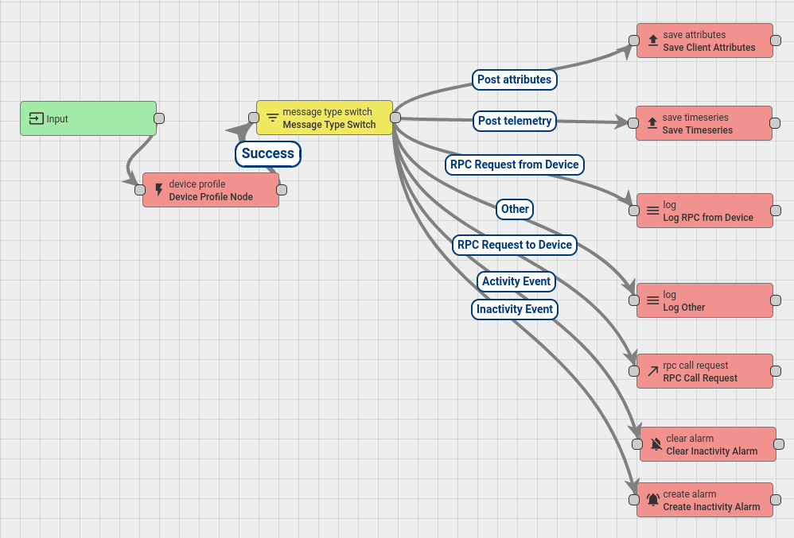

# M-IotArchitecture
design an IoT System using IoT devices, Management Console, MQTT  protocol and telemetry data. You will be able to process massive data with a rule engine, push commands to IOT device and finally you will create statistics from IOT devices. Tools and  technologies used in this project: Visual Studio Code, API Rest, Python, JSON.

# Architecture of the Project

We use 2 differents transports protocols to connect devices and send telemetry to thingsboard Server.

1) Via Http using axios in the front app, we are able to directly send data to the server.

2) And also using a thingsboard gateway: 

    - First we use eclipse-mosquitto container to create a MQTT Broker
    - Then we start the thingsboard/tb-gateway and we define connectors and mapping to connect to the MQTT Broker
    - The Gateway is configured to connect to the thingsboard Server 
    - And finally we can connect devices and send data using mqtt on the MQTT Broker address.

We defined 2 own rules on the Rule Chain (root): 

1) the first one is to detect when the connection with a device timeout: 
    - We set the timeout interval to 60000 milliseconds
    - The rule defined set an alarm to the device with a Critical Severity and we set the status to Active

2) the secound rule detect when a device receive some telemetry to clear the previous alarm:
    - if a device timeout and receive again some data, we clear the previous alarm and we set the status to Cleared