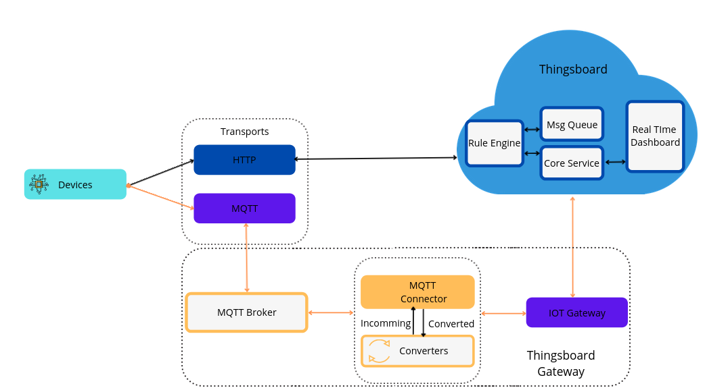

# M-IotArchitecture
design an IoT System using IoT devices, Management Console, MQTT  protocol and telemetry data. You will be able to process massive data with a rule engine, push commands to IOT device and finally you will create statistics from IOT devices. Tools and  technologies used in this project: Visual Studio Code, API Rest, Python, JSON.

# Architecture of the Project

